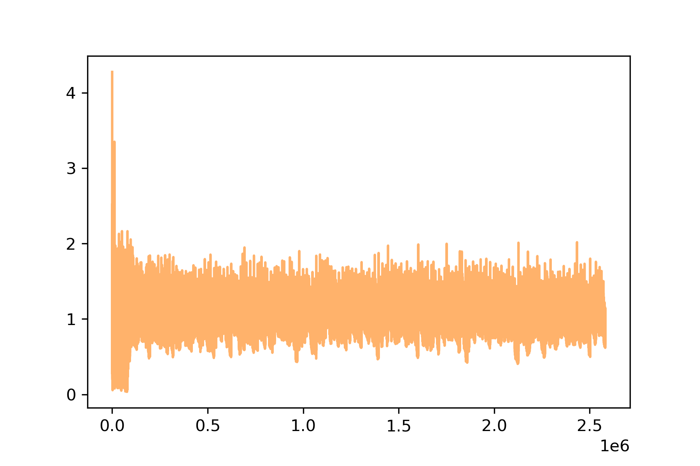
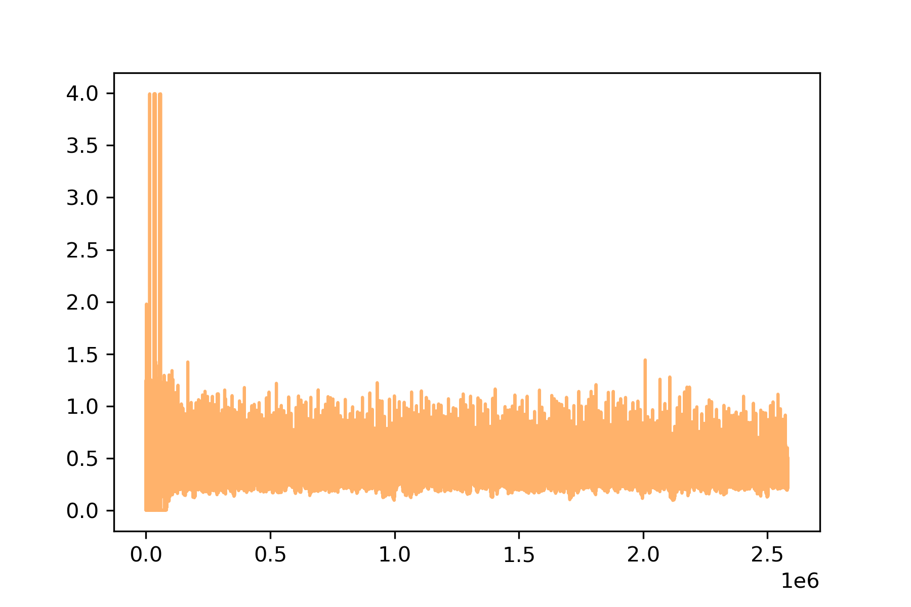

# ReversiPro

## Requirement

1. python >= 3.7
2. pytorch
3. tqdm


## Train

```shell
$ python train.py
```


## Play

```shell
$ python game_player.py
```


## Training

### Pi Loss





## Trained Model

[Model](https://drive.google.com/file/d/1H_n6JtUYgn_NozMmeJGE0aKLhGacaFe6/view?usp=sharing)

[Model](https://drive.google.com/file/d/1H_n6JtUYgn_NozMmeJGE0aKLhGacaFe6/view?usp=sharing)


## Reference

https://github.com/tensorflow/minigo

